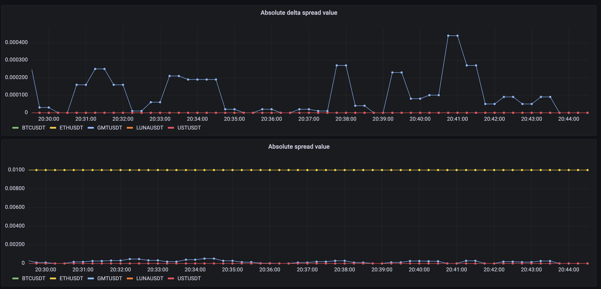
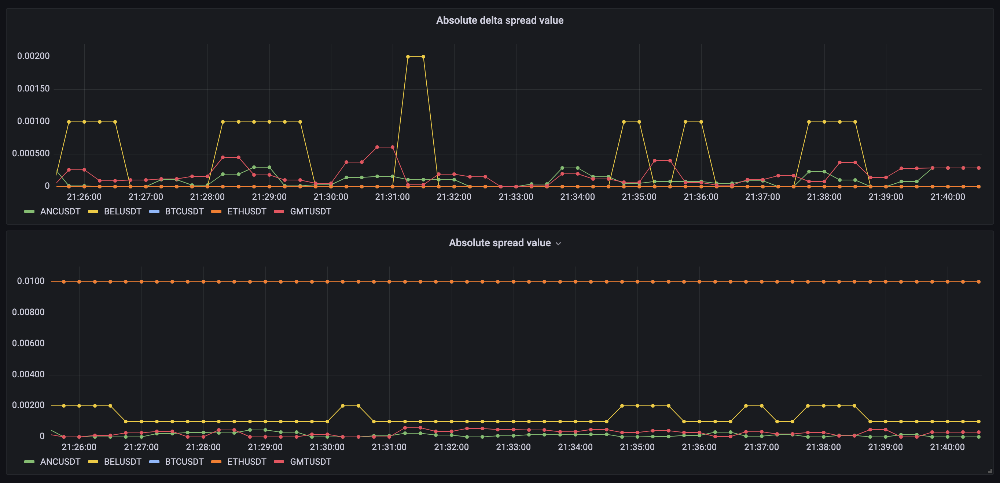

# Binance challenge

## Description

This repository contains python script and Dockerfile to run script which will answer questions from challenge.

We will not use unofficial library for [python-binance](https://python-binance.readthedocs.io/en/latest/) and will use only 'requests' library to make queries to [binance-spot-api-docs](https://github.com/binance/binance-spot-api-docs/blob/master/rest-api.md#general-information-on-endpoints).


## Questions:
1. Print the top 5 symbols with quote asset BTC and the highest volume over the last 24 hours in descending order.
2. Print the top 5 symbols with quote asset USDT and the highest number of trades over the last 24 hours in descending order.
3. Using the symbols from Q1, what is the total notional value of the top 200 bids and asks currently on each order book?
4. What is the price spread for each of the symbols from Q2?
5. Every 10 seconds print the result of Q4 and the absolute delta from the previous value for each symbol.
6. Make the output of Q5 accessible by querying http://localhost:8080/metrics using the Prometheus Metrics format.

## Pre-requisite
* make
* docker

## Usage
`make run`

Open [prometheus-metrics](http://127.0.0.1:8080)

## Parameterized usage
Build image 

`docker build -t binance-challenge .`

Get help for actions and options

`docker run -t binance-challenge --help`

Run with specific parameters

`docker run -t binance-challenge --action get-top-symbols --symbol USDT --field count`

## Going further 
This part is not in the challenge, but we will imagine we want to expose Prometheus metrics and make a graph using Grafana

### Install helm chart with our image 

```
cd binance-challenge
helm install binance-challenge .
```
This helm chart includes Deployment,Service and ServiceMonitor for Prometheus Operator in kubernetes.

We will collect metrics using Custom Resource Definition(ServiceMonitor) from Prometheus Operator and create dashboard with
'Absolute delta spread value' and 'Absolute spread value'. 
Those graphs use top symbols for 24h, some of them in 'BREAK' state, so we will not see spread with orders right now:



We will run this chart with additional parameters:
```
args:
  - "--action"
  - "prometheus"
  - "--only-trading"
```
to see top symbols spread and delta on symbols in 'TRADING' state:



### Uninstall helm chart
```
cd binance-challenge
helm uninstall binance-challenge 
```
